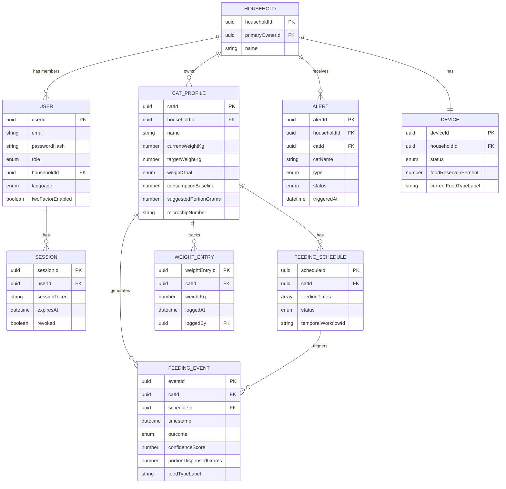

# Data Model Document
## TreatsAI - Smart Food, Zero Judgment 🐾

**Version:** 1.1  
**Date:** July 1, 2026  
**Author:** Joselyn Grace Gordillo Lopez  
**Hackathon:** Hack the Kitty - Cat World Domination Day

---

## 1. Purpose

This document defines the data model for TreatsAI - every entity the system stores, its attributes, and how the DynamoDB tables are structured to serve the application's access patterns efficiently.

---

## 2. Key Design Principles

### 2.1 DynamoDB Design Philosophy

DynamoDB is a NoSQL database. Unlike SQL databases where you design tables first and query freely later, DynamoDB requires designing around **access patterns** - the specific questions the application will ask the database. Tables are structured to answer those questions in a single read operation, without expensive joins.

### 2.2 Primary Keys

Every DynamoDB item is identified by:
- **Partition Key (PK)** - the primary lookup value. DynamoDB uses this to distribute data across storage nodes.
- **Sort Key (SK)** - an optional secondary value that allows range queries and ordering within the same partition.

### 2.3 UUID as Entity Identifier

Every entity in TreatsAI uses a **UUID v4** as its unique identifier - a 128-bit randomly generated string (e.g. `550e8400-e29b-41d4-a716-446655440000`). UUIDs are generated at creation time and never change. They are used as the primary key across all TreatsAI data stores, including DynamoDB and AWS Rekognition face collections.

### 2.4 Single Table Design

TreatsAI uses a **single DynamoDB table** (`TreatsAI`) for all entities. This is a DynamoDB best practice - storing all entities in one table with carefully designed key patterns allows efficient access without managing multiple tables or performing cross-table joins.

### 2.5 Denormalization Strategy

DynamoDB does not support joins. When an API response or SSE event requires data from multiple entities (e.g. an Alert needing the cat's name alongside its UUID), the required fields are **denormalized** - written into the item at creation time alongside the foreign key. This trades a small amount of storage for significantly faster reads.

Denormalized fields in TreatsAI:
- `catName` is stored in Alert items alongside `catId`
- `catName` is included in SSE event payloads at publish time

---

## 3. Access Patterns

These are the questions TreatsAI will ask the database, which drove every table design decision:

| # | Access Pattern | Operation |
|---|---|---|
| AP-01 | Get all cats for a given owner | Query by householdId |
| AP-02 | Get all feeding events for a given cat | Query by catId |
| AP-03 | Get all active alerts for a given owner | Query by householdId, filter by status |
| AP-04 | Get feeding events for a cat filtered by date range | Query by catId + timestamp range |
| AP-05 | Get weight history for a given cat | Query by catId, sorted by date |
| AP-06 | Get a single cat profile by UUID | Get by householdId + catId |
| AP-07 | Get all schedules for a given cat | Query by catId |
| AP-08 | Get all active sessions for a user | Query by userId |

---

## 4. Entities

### 4.1 User (Owner / Co-Owner)

Represents an authenticated user - either a Primary Owner or a Co-Owner invited to a household.

| Attribute | Type | Required | Description |
|---|---|---|---|
| `userId` | UUID | ✅ | Unique identifier, generated at registration |
| `email` | String | ✅ | Login email address, unique across all users |
| `passwordHash` | String | ✅ | Bcrypt-hashed password, never stored in plain text |
| `role` | Enum | ✅ | `primary_owner` or `co_owner` |
| `householdId` | UUID | ✅ | Links user to a household (created automatically for primary owners) |
| `coOwnerRole` | Enum | ❌ | `editor` or `viewer` - only present for Co-Owners (post-MVP) |
| `language` | Enum | ✅ | `en`, `it`, or `es` - user's selected UI language |
| `twoFactorEnabled` | Boolean | ✅ | Whether 2FA via Email OTP is active |
| `sessionPolicy` | Enum | ✅ | `standard` (7 days) or `remember_me` (until logout) |
| `createdAt` | ISO 8601 | ✅ | Account creation timestamp (UTC) |
| `updatedAt` | ISO 8601 | ✅ | Last profile update timestamp (UTC) |

---

### 4.2 Session

Represents an active authenticated session for a user. Sessions are stored to support the session listing and remote revocation features defined in FR-AUTH-03.

| Attribute | Type | Required | Description |
|---|---|---|---|
| `sessionId` | UUID | ✅ | Unique identifier, generated at login |
| `userId` | UUID | ✅ | Links session to a user |
| `sessionToken` | String | ✅ | Hashed session token (never stored in plain text) |
| `createdAt` | ISO 8601 | ✅ | Session creation timestamp (UTC) |
| `expiresAt` | ISO 8601 | ✅ | Session expiry timestamp (UTC) - null if `remember_me` |
| `userAgent` | String | ❌ | Browser/device user agent string for display in session list |
| `revoked` | Boolean | ✅ | Whether the session has been manually revoked (default: false) |
| `revokedAt` | ISO 8601 | ❌ | Timestamp of revocation (UTC) |

---

### 4.3 Household

Represents a shared household - the container that links one Primary Owner and zero or more Co-Owners to a shared set of cat profiles and devices.

| Attribute | Type | Required | Description |
|---|---|---|---|
| `householdId` | UUID | ✅ | Unique identifier |
| `primaryOwnerId` | UUID | ✅ | UUID of the Primary Owner user |
| `name` | String | ❌ | Optional household name (e.g. "The Lopez Household") |
| `createdAt` | ISO 8601 | ✅ | Creation timestamp (UTC) |

---

### 4.4 Cat Profile

Represents one individual cat registered in the system.

| Attribute | Type | Required | Description |
|---|---|---|---|
| `catId` | UUID | ✅ | Unique identifier, also used as Rekognition Collection ID |
| `householdId` | UUID | ✅ | Links cat to a household |
| `name` | String | ✅ | Cat's name, max 50 characters |
| `dateOfBirth` | ISO 8601 | ❌ | Cat's date of birth |
| `breed` | String | ❌ | Free-text breed description |
| `currentWeightKg` | Number | ✅ | Most recent logged weight in kilograms |
| `targetWeightKg` | Number | ❌ | Target weight (required if goal is not `maintenance`) |
| `weightGoal` | Enum | ✅ | `weight_loss`, `maintenance`, or `weight_gain` |
| `consumptionBaseline` | Number | ✅ | Expected consumption percentage (0–100), owner-set at onboarding, auto-refined over time |
| `suggestedPortionGrams` | Number | ❌ | System-calculated recommended portion size in grams, recalculated whenever weight is logged. Returned by the API as `updatedPortionSuggestionGrams` after each weight entry. |
| `photoS3Keys` | String[] | ✅ | Array of S3 object keys for the cat's training photos |
| `rekognitionCollectionId` | String | ✅ | AWS Rekognition Collection ID (same as `catId`) |
| `microchipNumber` | String | ❌ | ISO 11784/11785 15-digit microchip number (post-MVP) |
| `weightReminderInterval` | Number | ✅ | Days between weight-check reminders (3, 7, or 14) |
| `createdAt` | ISO 8601 | ✅ | Profile creation timestamp (UTC) |
| `updatedAt` | ISO 8601 | ✅ | Last update timestamp (UTC) |

---

### 4.5 Feeding Schedule

Represents a configured feeding schedule for one cat - one or more daily feeding times with portion sizes.

| Attribute | Type | Required | Description |
|---|---|---|---|
| `scheduleId` | UUID | ✅ | Unique identifier |
| `catId` | UUID | ✅ | Links schedule to a cat profile |
| `householdId` | UUID | ✅ | Links schedule to a household |
| `feedingTimes` | Object[] | ✅ | Array of feeding time entries (see below) |
| `feedingTimes[].time` | String | ✅ | Time in `HH:MM` format (24h), e.g. `"08:00"` |
| `feedingTimes[].portionGrams` | Number | ✅ | Portion size in grams for this feeding time |
| `feedingTimes[].suggestedPortionGrams` | Number | ❌ | System-suggested portion based on weight goal |
| `status` | Enum | ✅ | `active` or `paused` |
| `temporalWorkflowId` | String | ✅ | ID of the Temporal FeedingScheduleWorkflow managing this schedule |
| `createdAt` | ISO 8601 | ✅ | Creation timestamp (UTC) |
| `updatedAt` | ISO 8601 | ✅ | Last update timestamp (UTC) |

---

### 4.6 Feeding Event

Represents a single recorded feeding attempt - the core health data unit of TreatsAI.

| Attribute | Type | Required | Description |
|---|---|---|---|
| `eventId` | UUID | ✅ | Unique identifier |
| `catId` | UUID | ✅ | Links event to a cat profile |
| `scheduleId` | UUID | ✅ | Links event to the schedule that triggered it |
| `householdId` | UUID | ✅ | Links event to a household |
| `timestamp` | ISO 8601 | ✅ | Timestamp of the feeding attempt (UTC) - used as the canonical event time and record creation time |
| `outcome` | Enum | ✅ | `dispensed`, `skipped`, or `rejected` |
| `confidenceScore` | Number | ✅ | Rekognition confidence score (0–100) |
| `portionDispensedGrams` | Number | ❌ | Grams dispensed (only present if outcome is `dispensed`) |
| `consumptionPercent` | Number | ❌ | Estimated consumption percentage (owner-logged or simulated) |
| `foodTypeLabel` | String | ❌ | Free-text food type at time of feeding (e.g. "Whiskas Tuna") |
| `manualOverride` | Boolean | ✅ | Whether the owner manually triggered this dispense |

> **Note on `timestamp`:** In TreatsAI, `timestamp` serves as both the event time and the record creation time. Since feeding events are written immediately when they occur, no meaningful difference exists between the two. A separate `createdAt` field is therefore omitted to keep the schema clean.

---

### 4.7 Weight Entry

Represents a single manually logged weight measurement for a cat.

| Attribute | Type | Required | Description |
|---|---|---|---|
| `weightEntryId` | UUID | ✅ | Unique identifier |
| `catId` | UUID | ✅ | Links entry to a cat profile |
| `householdId` | UUID | ✅ | Links entry to a household |
| `weightKg` | Number | ✅ | Recorded weight in kilograms |
| `loggedAt` | ISO 8601 | ✅ | Timestamp of the measurement (UTC) |
| `loggedBy` | UUID | ✅ | UUID of the user who logged the entry |
| `notes` | String | ❌ | Optional owner notes (e.g. "post-vet visit") |

---

### 4.8 Alert

Represents a system-generated notification requiring owner attention.

| Attribute | Type | Required | Description |
|---|---|---|---|
| `alertId` | UUID | ✅ | Unique identifier |
| `householdId` | UUID | ✅ | Links alert to a household |
| `catId` | UUID | ❌ | Links alert to a cat (if cat-specific) |
| `catName` | String | ❌ | Denormalized cat name - stored at write time alongside `catId` to avoid a secondary read when listing alerts |
| `type` | Enum | ✅ | `skip_meal`, `baseline_deviation`, `weight_reminder`, `low_food_level` |
| `status` | Enum | ✅ | `active` or `acknowledged` |
| `triggeredAt` | ISO 8601 | ✅ | When the alert was generated (UTC) |
| `acknowledgedAt` | ISO 8601 | ❌ | When the owner dismissed the alert (UTC) |
| `acknowledgedBy` | UUID | ❌ | UUID of the user who dismissed the alert |
| `metadata` | Object | ❌ | Additional context (e.g. scheduled feeding time that was missed) |

---

### 4.9 Device

Represents the simulated smart feeder unit.

| Attribute | Type | Required | Description |
|---|---|---|---|
| `deviceId` | UUID | ✅ | Unique identifier |
| `householdId` | UUID | ✅ | Links device to a household |
| `status` | Enum | ✅ | `online` or `offline` |
| `foodReservoirPercent` | Number | ✅ | Current food level (0–100) |
| `currentFoodTypeLabel` | String | ❌ | Free-text current food type (e.g. "Royal Canin Chicken") |
| `lastDispenseAt` | ISO 8601 | ❌ | Timestamp of the last successful dispense (UTC) |
| `cameraStatus` | Enum | ✅ | `active` or `idle` |
| `firmwareVersion` | String | ✅ | Simulated firmware version string (e.g. `"1.0.0"`) |
| `createdAt` | ISO 8601 | ✅ | Device registration timestamp (UTC) |
| `updatedAt` | ISO 8601 | ✅ | Last state update timestamp (UTC) |

---

## 5. DynamoDB Table Design

### 5.1 Single Table: `TreatsAI`

All entities are stored in one table. The Partition Key (`PK`) and Sort Key (`SK`) use prefixed string patterns to separate entity types and enable efficient queries.

| Entity | PK | SK |
|---|---|---|
| User | `USER#<userId>` | `PROFILE` |
| Session | `USER#<userId>` | `SESSION#<sessionId>` |
| Household | `HOUSEHOLD#<householdId>` | `PROFILE` |
| Household Member | `HOUSEHOLD#<householdId>` | `MEMBER#<userId>` |
| Cat Profile | `HOUSEHOLD#<householdId>` | `CAT#<catId>` |
| Feeding Schedule | `CAT#<catId>` | `SCHEDULE#<scheduleId>` |
| Feeding Event | `CAT#<catId>` | `EVENT#<timestamp>#<eventId>` |
| Weight Entry | `CAT#<catId>` | `WEIGHT#<loggedAt>#<weightEntryId>` |
| Alert | `HOUSEHOLD#<householdId>` | `ALERT#<triggeredAt>#<alertId>` |
| Device | `HOUSEHOLD#<householdId>` | `DEVICE#<deviceId>` |

### 5.2 Access Pattern Mapping

| Access Pattern | PK | SK | Notes |
|---|---|---|---|
| AP-01: Get all cats for owner | `HOUSEHOLD#<householdId>` | begins_with `CAT#` | Requires householdId from user session |
| AP-02: Get all feeding events for cat | `CAT#<catId>` | begins_with `EVENT#` | Returns all events sorted by timestamp |
| AP-03: Get all alerts for household | `HOUSEHOLD#<householdId>` | begins_with `ALERT#` | Filter by status in application layer |
| AP-04: Get events by date range | `CAT#<catId>` | between `EVENT#<start>` and `EVENT#<end>` | Timestamp in SK enables range queries |
| AP-05: Get weight history for cat | `CAT#<catId>` | begins_with `WEIGHT#` | Sorted chronologically by loggedAt |
| AP-06: Get single cat profile | `HOUSEHOLD#<householdId>` | `CAT#<catId>` | Single item Get |
| AP-07: Get schedules for cat | `CAT#<catId>` | begins_with `SCHEDULE#` | Returns all schedules for the cat |
| AP-08: Get all sessions for user | `USER#<userId>` | begins_with `SESSION#` | Filter by revoked=false in application layer |

---

## 6. Entity Relationship Diagram

---

## 7. Changelog

| Version | Date | Changes |
|---|---|---|
| 1.0 | 2026-06-30 | Initial Data Model |
| 1.1 | 2026-07-01 | Added Session entity (AP-08); added `suggestedPortionGrams` to Cat Profile; added `catName` denormalization to Alert; clarified `timestamp` as canonical event time in Feeding Event; added `coOwnerRole` post-MVP note; added Section 2.5 Denormalization Strategy |