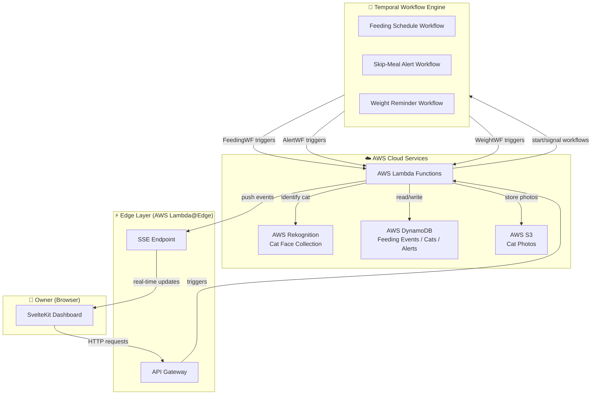
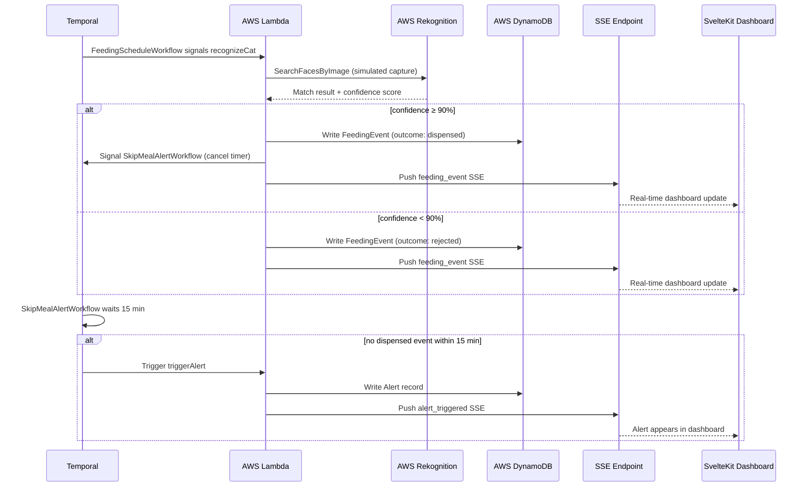

# Technical Architecture Document (TAD)
## TreatsAI — Smart Food, Zero Judgment 🐾

**Version:** 1.0  
**Date:** June 30, 2026  
**Author:** Joselyn Grace Gordillo Lopez  
**Hackathon:** Hack the Kitty — World Cat Domination Day

---

## 1. Purpose

This document describes the technical architecture of TreatsAI — how every component is structured, why each technology was chosen, and how data flows through the system. It is intended to give any developer or judge a complete understanding of the system without needing to read the source code.

---

## 2. Architecture Overview

TreatsAI is built as an **edge-first, event-driven web application** composed of four layers:

1. **Frontend** — SvelteKit application running on the edge, serving the owner dashboard
2. **Workflow Layer** — Temporal orchestrating all time-based and durable workflows
3. **Cloud Services** — AWS Lambda (compute), DynamoDB (database), Rekognition (computer vision), S3 (storage)
4. **Real-time Layer** — Server-Sent Events (SSE) pushing live updates to the dashboard

---

## 3. System Architecture Diagram



---

## 4. Technology Stack

### 4.1 Frontend — SvelteKit

**What it is:** SvelteKit is a full-stack web framework built on top of Svelte. Unlike React or Vue, Svelte compiles components to vanilla JavaScript at build time — there is no virtual DOM at runtime. This produces faster, lighter applications.

**Why we chose it:**
- **Edge-first by default** — SvelteKit deploys naturally to edge runtimes (AWS Lambda@Edge), meaning the app runs physically close to the user, reducing latency
- **Reactivity model** — Svelte's reactivity is built into the language syntax, not a library abstraction. This is architecturally different from React's hooks model and represents a deliberate, informed technology choice
- **File-based routing** — pages and API endpoints are defined by file structure, keeping the codebase organized and predictable
- **SSE support** — SvelteKit server routes handle SSE streams natively, with no additional libraries required

**Key conventions used:**
- `+page.svelte` — page components
- `+page.server.ts` — server-side data loading per page
- `+server.ts` — API endpoints and SSE streams
- `src/lib/` — shared components, utilities, and stores

---

### 4.2 Styling — Tailwind CSS v4

**What it is:** a utility-first CSS framework. Instead of writing custom CSS files, styles are applied directly in HTML/Svelte markup using predefined utility classes (e.g. `class="flex items-center gap-4 rounded-xl"`).

**Why we chose it:**
- Eliminates the need for a separate CSS architecture decision
- Produces consistent, responsive layouts with minimal code
- Tailwind v4 integrates directly with Vite (TreatsAI's build tool) via a plugin — zero config overhead
- The `@tailwindcss/forms` plugin normalizes form element styling across browsers — directly relevant to TreatsAI's settings and onboarding forms

---

### 4.3 Internationalisation — Paraglide JS

**What it is:** Paraglide is the official i18n (internationalisation) library for SvelteKit, built by the inlang team. It manages translations at compile time — translated strings are tree-shaken per language, meaning users only download the translations for the language they actually use.

**Why we chose it:**
- Native SvelteKit integration — zero configuration friction
- Supports EN, IT, and ES out of the box with our scaffold
- Compile-time translation loading means no runtime performance cost
- Language detection hook allows us to implement the browser language → timezone → default English detection hierarchy defined in FR-I18N-04

**Translation files location:** `messages/` folder at project root, one JSON file per language (`en.json`, `it.json`, `es.json`)

---

### 4.4 Workflow Orchestration — Temporal

**What it is:** Temporal is a durable workflow engine. It allows developers to write long-running, time-based workflows in regular code (TypeScript, in our case) with built-in guarantees: if the server crashes mid-workflow, Temporal replays the workflow from exactly where it stopped. No data is lost, no step is skipped.

**Why we chose it over a simple cron job:**
A cron job is a scheduled task that fires at a set time. If the server is down when the cron fires, the task is silently lost. For TreatsAI, a missed feeding alert or a skipped portion adjustment is not acceptable — these are health-relevant events. Temporal guarantees they happen, always.

**Workflows implemented in TreatsAI:**

| Workflow | Trigger | What it does |
|---|---|---|
| `FeedingScheduleWorkflow` | Cat schedule creation / update | Waits until each scheduled feeding time, then signals Lambda to trigger camera capture and recognition |
| `SkipMealAlertWorkflow` | Each scheduled feeding time | Starts a 15-minute timer after each scheduled feeding; if no `dispensed` event is received, triggers an alert |
| `WeightReminderWorkflow` | Owner configures reminder interval | Recurring workflow that fires every 3/7/14 days and pushes a weight-check reminder alert |
| `ConsumptionBaselineWorkflow` | Each feeding event logged | Updates the cat's learned Consumption Baseline using a rolling average of the last 14 feeding events |

**Temporal architecture:**
- Temporal Server runs locally in development (via Docker)
- Temporal Workers (TypeScript) run as AWS Lambda functions in production
- Workflows are defined in `src/lib/temporal/workflows/`
- Activities (the actual AWS/DB calls) are defined in `src/lib/temporal/activities/`

---

### 4.5 Computer Vision — AWS Rekognition

**What it is:** AWS Rekognition is a managed computer vision service. It provides face detection, face comparison, and face collection APIs — we use the **face collection** feature to store and identify individual cats.

**Why we chose it:**
- No ML model to train or host — Rekognition handles everything as an API call
- The face collection API is designed exactly for our use case: store multiple face embeddings per entity, then search a new image against the collection
- Runs within AWS Free Tier for our usage volume
- Returns a confidence score (0–100) per match, which maps directly to our Dispense Threshold logic

**How it works in TreatsAI:**

1. **Onboarding:** owner uploads 3–10 photos of their cat → Lambda calls `IndexFaces` to store embeddings in a Rekognition Collection, keyed by the cat's UUID
2. **Recognition:** at each feeding time → Lambda calls `SearchFacesByImage` with a simulated camera capture → Rekognition returns the best match and confidence score → if score ≥ 90%, dispense is triggered

**Important note for judges:** in the hackathon demo, the "camera capture" is simulated — a pre-uploaded test image is passed to Rekognition instead of a live camera feed. The Rekognition API calls, confidence scoring, and dispense logic are all real and functional.

---

### 4.6 Database — AWS DynamoDB

**What it is:** DynamoDB is a fully managed NoSQL database by AWS. Unlike SQL databases (which store data in tables with rigid schemas), DynamoDB stores items in flexible JSON-like documents, organized by a **partition key** (primary lookup value) and an optional **sort key** (secondary ordering value).

**Why we chose it:**
- Always Free tier covers our entire usage volume (25GB storage, 200M requests/month)
- No server to manage — fully serverless, scales automatically
- Native integration with AWS Lambda — same ecosystem, minimal latency
- Ideal for our access patterns: fetch all feeding events for a cat, fetch all alerts for an owner

**Table design:** see the Data Model Document (`docs/DATA_MODEL.md`) for full table definitions and access patterns.

---

### 4.7 Serverless Compute — AWS Lambda

**What it is:** Lambda is AWS's serverless compute service. Instead of running a persistent server, you deploy individual functions that execute on demand and shut down when done. You pay only for actual execution time — with our volume, this falls entirely within the Always Free tier.

**Why we chose it:**
- Zero server management
- Natural fit for event-driven architecture — each Lambda function handles one specific action (recognize cat, log event, trigger alert, etc.)
- Integrates natively with DynamoDB, Rekognition, S3, and API Gateway
- Temporal Workers run as Lambda functions in production

**Lambda functions in TreatsAI:**

| Function | Trigger | Responsibility |
|---|---|---|
| `recognizeCat` | Temporal FeedingScheduleWorkflow | Calls Rekognition, evaluates confidence, triggers dispense or rejection |
| `logFeedingEvent` | Post-recognition | Writes feeding event to DynamoDB |
| `triggerAlert` | Temporal SkipMealAlertWorkflow | Creates alert record in DynamoDB, pushes SSE event |
| `updateBaseline` | Temporal ConsumptionBaselineWorkflow | Recalculates cat's Consumption Baseline |
| `sseStream` | Dashboard connection | Maintains SSE stream per authenticated owner |

---

### 4.8 File Storage — AWS S3

**What it is:** S3 (Simple Storage Service) is AWS's object storage — used for storing files (images, documents) rather than structured data.

**Why we chose it:**
- Cat profile photos uploaded during onboarding are stored in S3 before being passed to Rekognition
- Free tier: 5GB storage — more than sufficient for a demo
- Pre-signed URLs allow secure, temporary direct access to photos from the frontend without exposing S3 credentials

---

### 4.9 Real-Time Updates — Server-Sent Events (SSE)

**What it is:** SSE is a web standard that allows a server to push data to a browser over a persistent HTTP connection — without the browser needing to ask ("poll") repeatedly. The connection flows in one direction only: server → browser.

**Why SSE over WebSockets:**
- WebSockets are bidirectional (browser ↔ server) — TreatsAI only needs server → browser updates (feeding events, alerts, device status). SSE is simpler, lighter, and natively supported in SvelteKit server routes
- SSE connections automatically reconnect if dropped — built-in resilience with no extra code
- No additional infrastructure required — SSE runs over standard HTTP

**SSE events in TreatsAI:**

| Event name | Payload | Trigger |
|---|---|---|
| `feeding_event` | Cat UUID, outcome, confidence, timestamp | Every recognition attempt |
| `alert_triggered` | Alert type, cat name, timestamp | Skip-meal or baseline deviation detected |
| `alert_dismissed` | Alert UUID, acknowledged timestamp | Owner dismisses an alert |
| `device_status` | Online/offline, food level | Device state change |
| `weight_reminder` | Cat name, days since last log | Temporal WeightReminderWorkflow fires |

---

## 5. Data Flow — Feeding Event (End to End)



---

## 6. Architecture Decision Records (ADRs)

An **ADR** (Architecture Decision Record) documents a significant technical decision — what was chosen, what was considered, and why. This section exists so judges and future developers understand that every choice was deliberate.

### ADR-001: SvelteKit over React/Next.js
- **Decision:** Use SvelteKit as the frontend framework
- **Considered:** React + Next.js (familiar), Vue + Nuxt (partially familiar), SvelteKit (new)
- **Rationale:** Edge-first deployment, compile-time reactivity, and a deliberate choice to demonstrate architectural curiosity and growth. The learning curve was accepted as a calculated risk in exchange for a more original technical story.

### ADR-002: Temporal over cron jobs / step functions
- **Decision:** Use Temporal for all time-based workflows
- **Considered:** AWS EventBridge (cron), AWS Step Functions, simple setTimeout chains
- **Rationale:** TreatsAI's feeding alerts and weight reminders are health-relevant — silent failures are unacceptable. Temporal's durable execution model guarantees workflows complete even across server restarts. No other option provides this guarantee at the same level of simplicity.

### ADR-003: SSE over WebSockets
- **Decision:** Use Server-Sent Events for real-time dashboard updates
- **Considered:** WebSockets (bidirectional), polling (repeated HTTP requests), SSE (unidirectional push)
- **Rationale:** TreatsAI's real-time needs are strictly server → browser. WebSockets add bidirectional complexity that is unnecessary here. SSE is simpler, natively supported in SvelteKit, and auto-reconnects on drop.

### ADR-004: AWS Rekognition over custom ML model
- **Decision:** Use AWS Rekognition's managed face collection API
- **Considered:** Custom YOLOv8 model (fine-tuned for cats), TensorFlow.js (client-side inference), AWS Rekognition
- **Rationale:** Training and hosting a custom model is a multi-day effort incompatible with a 5-day solo hackathon timeline. Rekognition provides production-grade accuracy via a simple API call, with confidence scoring built in. This is the correct engineering tradeoff: use managed services for solved problems, invest custom effort where it creates unique value.

### ADR-005: DynamoDB over PostgreSQL/RDS
- **Decision:** Use DynamoDB as the primary database
- **Considered:** PostgreSQL on RDS (relational, familiar), DynamoDB (NoSQL, serverless)
- **Rationale:** TreatsAI's access patterns (fetch events by cat, fetch alerts by owner) are key-value and list operations — a natural fit for DynamoDB. RDS introduces server management overhead and exits the Always Free tier after the trial period. DynamoDB's Always Free tier covers our usage indefinitely.

---

## 7. Security Architecture

- All API keys and AWS credentials are stored as environment variables — never hardcoded or committed to the repository
- AWS IAM roles follow the **principle of least privilege** — each Lambda function has only the permissions it needs (e.g. `recognizeCat` has Rekognition read access only, not DynamoDB write access)
- Authentication is handled via secure session tokens — see FR-AUTH in the FRD
- 2FA via Email OTP is supported for all owner accounts
- S3 cat photos are accessed via pre-signed URLs with short expiration (15 minutes) — never exposed via public bucket URLs
- An Aikido Security scan report is included in `docs/SECURITY_REPORT.md`

---

## 8. Development Environment

| Tool | Version | Purpose |
|---|---|---|
| Node.js | 22.13.1 | JavaScript runtime |
| npm | 10.x | Package manager |
| SvelteKit | 2.x | Frontend framework |
| Svelte | 5.x | Component compiler |
| TypeScript | 6.x | Type safety |
| Tailwind CSS | 4.x | Styling |
| Paraglide JS | 2.x | i18n |
| Temporal SDK | latest | Workflow orchestration |
| AWS SDK v3 | latest | AWS service clients |
| Vite | 8.x | Build tool and dev server |

---

## 9. Deployment

- **Frontend:** SvelteKit deployed to AWS Lambda@Edge via `@sveltejs/adapter-aws`
- **Backend functions:** AWS Lambda (Node.js 22 runtime)
- **Database:** AWS DynamoDB (on-demand capacity mode, Always Free tier)
- **Storage:** AWS S3 (standard tier, Free tier)
- **CV:** AWS Rekognition (Free tier: 5,000 images/month)
- **Workflows:** Temporal Cloud (free tier) or self-hosted Temporal Server on AWS EC2

---

## 10. Local Development Setup

```bash
# Clone the repository
git clone https://github.com/EnigmaJoy/TreatsAI.git
cd TreatsAI

# Install dependencies
npm install

# Copy environment variables template
cp .env.example .env
# Fill in your AWS credentials and Temporal connection string

# Start Temporal locally (requires Docker)
docker compose up -d

# Start the development server
npm run dev
```

See `README.md` for full setup instructions including AWS account configuration.